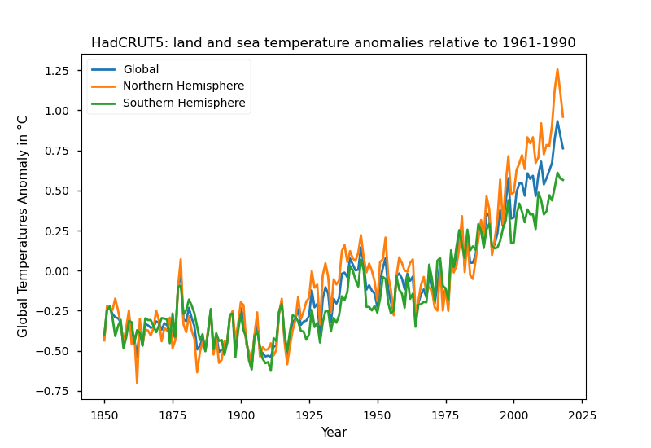

# Visualize the HadCRUT5 temperature datasets

From the [HadCRUT5](https://www.metoffice.gov.uk/hadobs/hadcrut5/index.html) site:

> HadCRUT5 is a gridded dataset of global historical surface temperature anomalies relative to a 1961-1990 reference period.
> Data are available for each month from January 1850 to December 2018 (updates will be available in time), on a 5 degree grid.
> The dataset is a collaborative product of the Met Office Hadley Centre and the Climatic Research Unit at the University of East Anglia.

Datasources: https://www.metoffice.gov.uk/hadobs/hadcrut5/data/current/download.html

