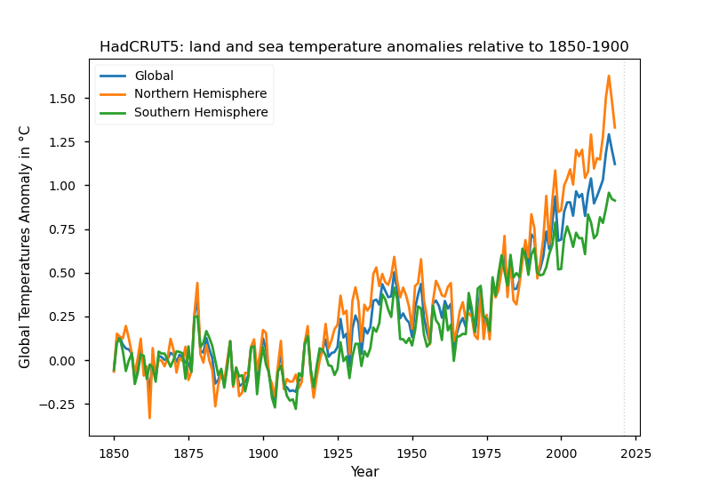
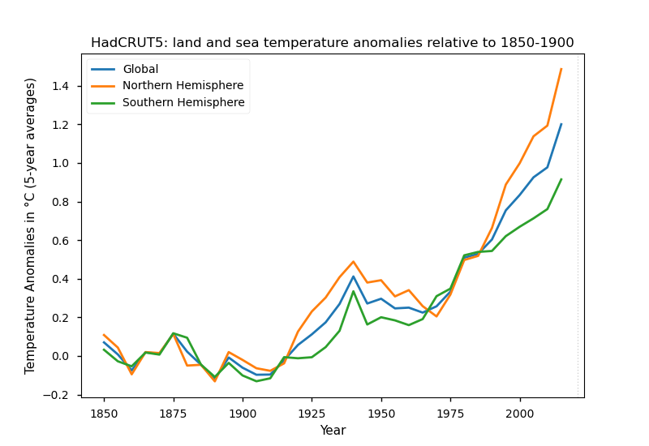

# Visualize the HadCRUT5 temperature datasets

From the [HadCRUT5](https://www.metoffice.gov.uk/hadobs/hadcrut5/index.html) site:

> HadCRUT5 is a gridded dataset of global historical surface temperature anomalies relative to a 1961-1990 reference period.
> Data are available for each month from January 1850 to December 2018 (updates will be available in time), on a 5 degree grid.
> The dataset is a collaborative product of the Met Office Hadley Centre and the Climatic Research Unit at the University of East Anglia.

Datafiles that are loaded by the Python script:
 * HadCRUT.5.0.0.0.analysis.summary_series.global.annual.nc
 * HadCRUT.5.0.0.0.analysis.summary_series.northern_hemisphere.annual.nc
 * HadCRUT.5.0.0.0.analysis.summary_series.southern_hemisphere.annual.nc

HadCRUT5 data taken from: https://www.metoffice.gov.uk/hadobs/hadcrut5/data/current/download.html

## Plot of the temperature anomalies

The following plots have been generated by the Python script `hadcrut5-plot.py`.
It requires the Python libraries: Matplotlib, netCDF4, NumPy, and Requests.

### Related to 1961-1990

```
$ ./hadcrut5-plot.py --outfile HadCRUT.png
```


### Related to 1850-1900

```
$ ./hadcrut5-plot.py --period "1850-1900" --outfile HadCRUT-1850-1900.png
```



### Related to 1850-1900 (smoothed version)

```
$ ./hadcrut5-plot.py --period "1850-1900" --smoother --outfile HadCRUT-1850-1900-smoother.png
```


