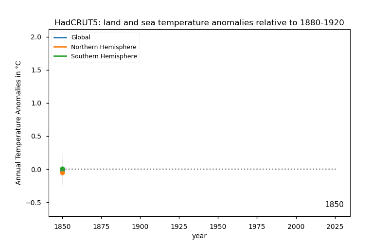

# Visualize the HadCRUT5 temperature datasets


[](https://spdx.org/licenses/GPL-3.0-only.html)
[](https://github.com/madrisan/HadCRUT5/stargazers)

> HadCRUT5 is a gridded dataset of global historical surface temperature anomalies relative to a 1961-1990 reference period.
> Data are available for each month from January 1850 onwards, on a 5 degree grid and as global and regional average time series.
> The dataset is a collaborative product of the Met Office Hadley Centre and the Climatic Research Unit at the University of East Anglia.
>
> The current version of HadCRUT5 is HadCRUT.5.1.0.0, available from the download page.
>
> &mdash; source: [HadCRUT5 Index](https://www.metoffice.gov.uk/hadobs/hadcrut5/index.html)

A detailed description of the datasets can be found in the
[`Answers to Frequently Asked Questions`](https://crudata.uea.ac.uk/cru/data/temperature/).

List of the datafiles that are loaded by the Python script:
 * `HadCRUT.5.1.0.0.analysis.summary_series.global.annual.nc`
 * `HadCRUT.5.1.0.0.analysis.summary_series.northern_hemisphere.annual.nc`
 * `HadCRUT.5.1.0.0.analysis.summary_series.southern_hemisphere.annual.nc`

HadCRUT5 data are downloaded from: https://www.metoffice.gov.uk/hadobs/hadcrut5/data/HadCRUT.5.1.0.0/download.html

## Plot of the temperature anomalies

The following plots have been generated by the Python scripts `hadcrut5_plot.py` and `hadcrut5_bars.py`.
They require the Python libraries: Matplotlib, netCDF4, NumPy, and Requests.

If Python and the required libraries are not installed on your system, you can simply
[install](https://docs.astral.sh/uv/getting-started/installation/) `uv` and run the commands listed below prefixed
with `uv run`. For example `uv run ./hadcrut5_plot.py`.

## hadcrut5_plot.py &mdash; Script usage

```
$ ./hadcrut5_plot.py --help
usage: hadcrut5_plot.py [-h] [-a ANNOTATE] [-f OUTFILE] [-g] [-m SMOOTHER]
                        [-n] [-p PERIOD] [-s] [-r] [-t TIME_SERIES] [-v]

Parse and plot the HadCRUT5 temperature datasets v2026.1 (stable)
Copyright (C) 2020-2026 Davide Madrisan <d.madrisan@proton.me>
License: GNU General Public License v3.0

options:
  -h, --help            show this help message and exit
  -a, --annotate ANNOTATE
                        add temperature annotations (0: no annotations, 1
                        (default): bottom only, 2: all ones
  -f, --outfile OUTFILE
                        name of the output PNG file
  -g, --global          plot the Global Temperatures
  -m, --smoother SMOOTHER
                        make the lines smoother by using N-year means
  -n, --northern        Northern Hemisphere Temperatures
  -p, --period PERIOD   show anomalies related to 1961-1990 (default),
                        1850-1900, or 1880-1920
  -s, --southern        Southern Hemisphere Temperatures
  -r, --trends          add linear-fit trend lines for 1970-2010 and
                        2010-present to the Global Temperatures, showing the
                        acceleration of global warming
  -t, --time-series TIME_SERIES
                        do plot the "annual" time series (default) or the
                        "monthly" one
  -v, --verbose         make the operation more talkative

examples:
  hadcrut5_plot.py
  hadcrut5_plot.py --global --annotate=2
  hadcrut5_plot.py --period "1850-1900"
  hadcrut5_plot.py --period "1850-1900" --smoother 5
  hadcrut5_plot.py --period "1880-1920" --outfile HadCRUT5-1880-1920.png
  hadcrut5_plot.py --period "1880-1920" --time-series monthly --global
  hadcrut5_plot.py --period "1880-1920" --global --trends
```

`hadcrut5_plot.py` select the period `1961-90` by default but supports (see the command-line switch`--period`) two other base periods found in the literature: `1850-1900`, and `1880-1920`.

```
$ ./hadcrut5_plot.py --annotate=2 --outfile plots/HadCRUT5-1961-1990.png
```


```
$ ./hadcrut5_plot.py --annotate=2 --period "1850-1900" --outfile plots/HadCRUT5-1850-1900.png
```


```
$ ./hadcrut5_plot.py --annotate=2 --period "1880-1920" --outfile plots/HadCRUT5-1880-1920.png
```


#### Plots showing the acceleration of global warming

The command-line option `--trends` overlays two linear-fit trend lines on the Global Temperatures: one for `1970-2010`
and one for `2010-present`, each labelled with its slope in °C/decade. Comparing the two makes the acceleration of
global warming immediately visible: the more recent trend line is both steeper and clearly diverges above the older
one.

```
$ ./hadcrut5_plot.py --annotate=2 --period "1880-1920" --trends --outfile plots/HadCRUT5-global-trends.png
```


The `2010-present` trend line is also extrapolated 10 years past the last available year, with a boxed annotation
and a matching note in the legend showing the forecast temperature for that future year.

This forecast value is *not* simply the last observed anomaly plus ten years of the slope. It is the regression
line's own value, i.e. `slope × forecast_year + intercept`, projected forward. Because annual anomalies are noisy,
the fitted trend line for the last available year rarely matches the actual observed anomaly for that same year
exactly, so `forecast value != last observed anomaly + slope × decade`. Extrapolating from the regression line
rather than from the last single (noisy) data point gives a more stable estimate of where the underlying trend is
heading.

### Plots using the N-year mean data

By adding the command-line option `--smoother N` you can create the same three plots, but using the N-year means data.
For instance `--smoother 5` will get you a better idea of the trend lines.

Image generated for the anomalies related to the period `1880-1920`.
```
$ ./hadcrut5_plot.py --period "1880-1920" --smoother 5 --outfile plots/HadCRUT5-1880-1920-smoother.png
```


### Plots using the monthly mean data

The command-line option `--time-series monthly` selects the monthly HadCRUT5 datasets (by default the dataset providing the annual means is selected).

Image displying the monthly anomalies related to the period `1880-1920`, for the global temperatures only.
```
$ ./hadcrut5_plot.py --global --period "1880-1920" --time-series monthly
```


## hadcrut5_bars.py &mdash; Script usage

```
usage: hadcrut5_bars.py [-h] [-f OUTFILE] [-p PERIOD] [-v]

Parse and plot the HadCRUT5 temperature datasets v2024.1 (stable)
Copyright (C) 2020-2025 Davide Madrisan <d.madrisan@proton.me>
License: GNU General Public License v3.0

options:
  -h, --help            show this help message and exit
  -f OUTFILE, --outfile OUTFILE
                        name of the output PNG file
  -p PERIOD, --period PERIOD
                        show anomalies related to 1961-1990 (default), 1850-1900, or 1880-1920
  -v, --verbose         make the operation more talkative

examples:
  hadcrut5_bars.py
  hadcrut5_bars.py --period "1850-1900"
  hadcrut5_bars.py --period "1880-1920"
  hadcrut5_bars.py --outfile HadCRUT5-global.png
```
The image for to the anomalies related to the period `1880-1920` follows.
```
$ ./hadcrut5_bars.py --period "1880-1920" --outfile plots/HadCRUT5-global-1880-1920.png
```


## hadcrut5_stripe.py &mdash; Script usage

```
usage: hadcrut5_stripe.py [-h] [-f OUTFILE] [-r {global,northern,southern}] [-v] [-l]

Parse and plot a stripe image of the HadCRUT5 temperature datasets v2024.1 (stable)
Copyright (C) 2020-2025 Davide Madrisan <d.madrisan@proton.me>
License: GNU General Public License v3.0

options:
  -h, --help            show this help message and exit
  -f OUTFILE, --outfile OUTFILE
                        name of the output PNG file
  -r {global,northern,southern}, --region {global,northern,southern}
                        select between Global (default), Northern, or Southern Temperatures
  -v, --verbose         make the operation more talkative
  -l, --no-labels       do not disply the header and footer labels

examples:
  hadcrut5_stripe.py
  hadcrut5_stripe.py --no-labels --region northern
  hadcrut5_stripe.py --region global --outfile HadCRUT5-stripe-global.png
```

Below is a generated striped image for global anomalies.
```
$ ./hadcrut5_stripe.py --region global
```


## hadcrut5_close.py &mdash; Script usage

```
usage: hadcrut5_close.py [-h] [-f OUTFILE] [-p PERIOD] [-r {global,northern,southern}] [-v]

Parse and plot the approach of HadCRUT5 dataset to a threshold temperature v2025.1 (stable)
Copyright (C) 2020-2025 Davide Madrisan <d.madrisan@proton.me>
License: GNU General Public License v3.0

options:
  -h, --help            show this help message and exit
  -f, --outfile OUTFILE
                        name of the output PNG file
  -p, --period PERIOD   show anomalies related to 1961-1990 (default), 1850-1900, or 1880-1920
  -r, --region {global,northern,southern}
                        select between Global (default), Northern, or Southern Temperatures
  -v, --verbose         make the operation more talkative

examples:
  hadcrut5_close.py
  hadcrut5_close.py --period "1850-1900" --region global
  hadcrut5_close.py --period "1880-1920" --outfile "HadCRUT5-1880-1920-threshold.png"
```

Below is a generated plot image for global anomalies related to the period `1880-1920` with a threshold set to 1.5°C.
```
$ ./hadcrut5_close.py --period "1880-1920" --region global
```


## hadcrut5_animate.py &mdash; Script usage

```
$ ./hadcrut5_animate.py --help
usage: hadcrut5_animate.py [-h] [-b BITRATE] [-f OUTFILE] [--fps FPS]
                           [--hold HOLD] [-g] [-n] [-p PERIOD] [-s] [-v]

Create an animated plot of the HadCRUT5 temperature datasets v2026.1 (stable)
Copyright (C) 2020-2026 Davide Madrisan <d.madrisan@proton.me>
License: GNU General Public License v3.0

options:
  -h, --help            show this help message and exit
  -b, --bitrate BITRATE
                        bitrate (in kbps) of the encoded MP4 video, ignored
                        for GIF output (default: 1800)
  -f, --outfile OUTFILE
                        name of the output file (.mp4 or .gif); if not set the
                        animation is displayed interactively instead
  --fps FPS             frames per second of the encoded video (default: 25)
  --hold HOLD           seconds to hold the last frame at the end of the
                        animation (default: 2.0)
  -g, --global          plot the Global Temperatures
  -n, --northern        Northern Hemisphere Temperatures
  -p, --period PERIOD   show anomalies related to 1961-1990 (default),
                        1850-1900, or 1880-1920
  -s, --southern        Southern Hemisphere Temperatures
  -v, --verbose         make the operation more talkative

examples:
  hadcrut5_animate.py
  hadcrut5_animate.py --global
  hadcrut5_animate.py --period "1880-1920"
  hadcrut5_animate.py --period "1880-1920" --outfile HadCRUT5-1880-1920-animation.mp4
  hadcrut5_animate.py --period "1880-1920" --outfile HadCRUT5-1880-1920-animation.gif
  hadcrut5_animate.py --fps 30 --hold 5 --outfile HadCRUT5-animation.mp4
```

This script reveals the selected regions year by year instead of drawing the whole time series at once. Without
`--outfile` the animation is displayed interactively. An `.mp4` output requires `ffmpeg` to be installed; a `.gif`
output only needs Pillow (already a Matplotlib dependency). GitHub's Markdown renderer strips `<video>` tags for
repo-hosted files, so the GIF format is what's embedded below.

```
$ ./hadcrut5_animate.py --period "1880-1920" --outfile plots/HadCRUT5-1880-1920-animation.gif
```


# License

The Python code of this project is released under the [GPL-3.0 license](https://github.com/madrisan/HadCRUT5/blob/main/LICENSE).
The graphics have a [CC-BY4.0 license](https://creativecommons.org/licenses/by/4.0/), so can be used for any purpose as long as credit is given to Madrisan Davide and a link is provided to this website.
