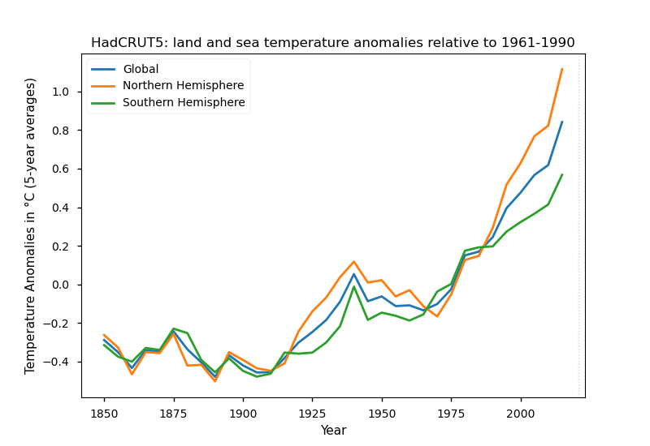

# Visualize the HadCRUT5 temperature datasets

> HadCRUT5 is a gridded dataset of global historical surface temperature anomalies relative to a 1961-1990 reference period.
> Data are available for each month from January 1850 to December 2018 (updates will be available in time), on a 5 degree grid.
> The dataset is a collaborative product of the Met Office Hadley Centre and the Climatic Research Unit at the University of East Anglia.
>
> &mdash; source: [HadCRUT5](https://www.metoffice.gov.uk/hadobs/hadcrut5/index.html)

Datafiles that are loaded by the Python script:
 * HadCRUT.5.0.0.0.analysis.summary_series.global.annual.nc
 * HadCRUT.5.0.0.0.analysis.summary_series.northern_hemisphere.annual.nc
 * HadCRUT.5.0.0.0.analysis.summary_series.southern_hemisphere.annual.nc

HadCRUT5 data taken from: https://www.metoffice.gov.uk/hadobs/hadcrut5/data/current/download.html

## Plot of the temperature anomalies

The following plots have been generated by the Python script `hadcrut5-plot.py`.
It requires the Python libraries: Matplotlib, netCDF4, NumPy, and Requests.

### Related to 1961-1990

> Stations on land are at different elevations, and different countries calculate average monthly temperatures using different methods and formulae.
> To avoid biases that could result from these differences, monthly average temperatures are reduced to anomalies from the period with best coverage (1961-90).
> For stations to be used, an estimate of the base period average must be calculated.
> Because many stations do not have complete records for the 1961-90 period several methods have been developed to estimate 1961-90 averages from neighbouring records or using other sources of data (see Osborn and Jones, 2014; Jones et al., 2012).
>
> Over the oceans, where observations are generally made from mobile platforms, it is impossible to assemble long series of actual temperatures for fixed points.
> However it is possible to interpolate historical data to create spatially complete reference climatologies (averages for 1961-90) so that individual observations can be compared with a local normal for the given day of the year (more discussion in Kennedy et al., 2011). 
>
> &mdash; source: [HadCRUT5](https://crudata.uea.ac.uk/cru/data/temperature/#faq5)

```
$ ./hadcrut5-plot.py --outfile HadCRUT.png
```


```
$ ./hadcrut5-plot.py --smoother --outfile HadCRUT.png
```



### Related to 1850-1900

> Previously, the period 1850-1900 has been used as the historical baseline, but this period includes some large volcanic eruptions and is after greenhouse gas concentrations had already started to rise.
> We suggest that the earlier period of 1720-1800 is a better choice for this baseline.
> This is because the major natural factors that also affect Earth’s climate – the levels of solar and volcanic activity – were both at similar levels to today. 
>
> &mdash; source: [Climate Lab Book](https://www.climate-lab-book.ac.uk/2017/defining-pre-industrial/)
```
$ ./hadcrut5-plot.py --period "1850-1900" --outfile HadCRUT-1850-1900.png
```


```
$ ./hadcrut5-plot.py --period "1850-1900" --smoother --outfile HadCRUT-1850-1900-smoother.png
```


