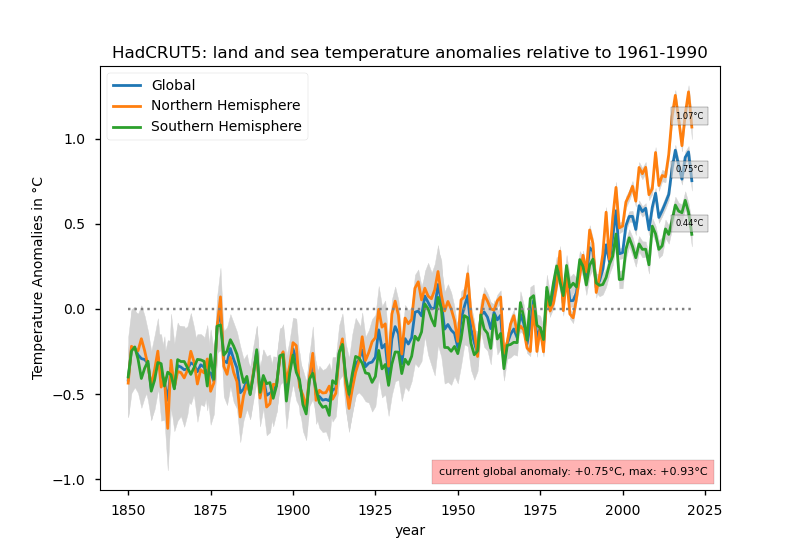
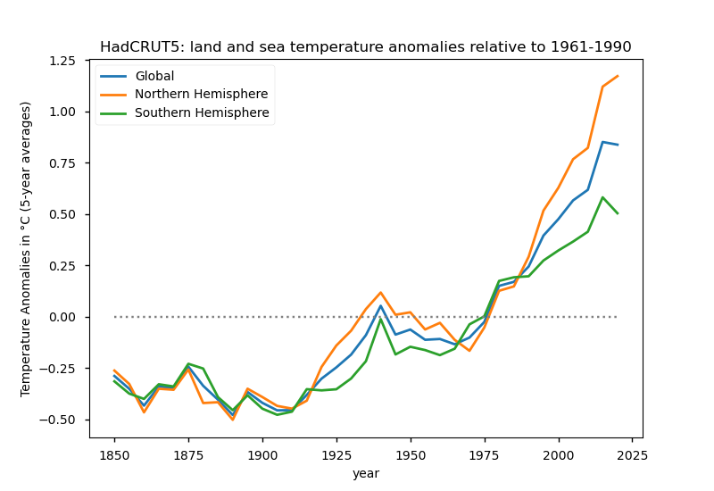

# Visualize the HadCRUT5 temperature datasets

> HadCRUT5 is a gridded dataset of global historical surface temperature anomalies relative to a 1961-1990 reference period.
> Data are available for each month from January 1850 to December 2018 (updates will be available in time), on a 5 degree grid.
> The dataset is a collaborative product of the Met Office Hadley Centre and the Climatic Research Unit at the University of East Anglia.
>
> HadCRUT5 data has now been updated to include data to the year 2020 in HadCRUT.5.0.1.0, available from the download page.
>
> &mdash; source: [HadCRUT5](https://www.metoffice.gov.uk/hadobs/hadcrut5/index.html)

Datafiles that are loaded by the Python script:
 * HadCRUT.5.0.1.0.analysis.summary_series.global.annual.nc
 * HadCRUT.5.0.1.0.analysis.summary_series.northern_hemisphere.annual.nc
 * HadCRUT.5.0.1.0.analysis.summary_series.southern_hemisphere.annual.nc

HadCRUT5 data taken from: https://www.metoffice.gov.uk/hadobs/hadcrut5/data/current/download.html

## Plot of the temperature anomalies

The following plots have been generated by the Python script `hadcrut5-plot.py`.
It requires the Python libraries: Matplotlib, netCDF4, NumPy, and Requests.

> Stations on land are at different elevations, and different countries calculate average monthly temperatures using different methods and formulae.
> To avoid biases that could result from these differences, monthly average temperatures are reduced to anomalies from the period with best coverage (1961-90).
>
> &mdash; source: [HadCRUT5](https://crudata.uea.ac.uk/cru/data/temperature/#faq5)

## Script usage

```
$ ./hadcrut5-plot.py --help
usage: hadcrut5-plot.py [-h] [-f OUTFILE] [-p PERIOD] [-m] [-g] [-n] [-s]

Parse and plot the HadCRUT5 temperature datasets v.2 (beta)
Copyright (C) 2020-2021 Davide Madrisan <davide.madrisan@gmail.com>
License: GNU General Public License v3.0

optional arguments:
  -h, --help            show this help message and exit
  -f OUTFILE, --outfile OUTFILE
                        name of the output PNG file
  -p PERIOD, --period PERIOD
                        show anomalies related to 1961-1990 (default), 1850-1900, or 1880-1920
  -m, --smoother        make the lines smoother by using 5-year means
  -g, --global          plot the Global Temperatures
  -n, --northern        Northern Hemisphere Temperatures
  -s, --southern        Southern Hemisphere Temperatures

examples:
  hadcrut5-plot.py
  hadcrut5-plot.py --global
  hadcrut5-plot.py --outfile HadCRUT5.png
  hadcrut5-plot.py --period "1850-1900" --outfile HadCRUT5-1850-1900.png
  hadcrut5-plot.py --period "1880-1920" --outfile HadCRUT5-1880-1920.png
  hadcrut5-plot.py --period "1850-1900" --smoother --outfile HadCRUT-1850-1900-smoother.png
```

`hadcrut5-plot.py` select the period `1961-90` by default but supports (see the command-line switch`--period`) two other base periods found in the literature: `1850-1900`, and `1850-1900`.

```
$ ./hadcrut5-plot.py --outfile plots/HadCRUT5.png
```


```
$ ./hadcrut5-plot.py --period "1850-1900" --outfile plots/HadCRUT5-1850-1900.png
```


```
$ ./hadcrut5-plot.py --period "1880-1920" --outfile plots/HadCRUT5-1880-1920.png
```


### Plots using the 5-year mean data

By adding the command-line option `--smoother` you can create the same three plots, but using the 5-year means data.
This will give you a better idea of the trend lines.

```
$ ./hadcrut5-plot.py --smoother --outfile plots/HadCRUT5-smoother.png
```


```
$ ./hadcrut5-plot.py --period "1850-1900" --smoother --outfile plots/HadCRUT5-1850-1900-smoother.png
```


```
$ ./hadcrut5-plot.py --period "1880-1920" --smoother --outfile plots/HadCRUT5-1880-1920-smoother.png
```

